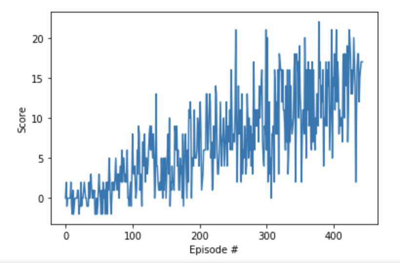

# Implementation

The submission includes a file in the root of the GitHub repository or zip file (one of Report.md, Report.ipynb, or Report.pdf) that provides a description of the implementation.

Along with writing the report, I'd also suggest you to write a blog post on this project like on Medium https://medium.com/ which is easier to write on. It will not take you much longer into your write-up and also include the tips given in this review. :D This is a great way to contribute to the AI community by sharing the knowledge.

# Learning Algorithm and Model Architecture

The report clearly describes the learning algorithm, along with the chosen hyperparameters. It also describes the model architectures for any neural networks.

In the report, you should define the Q-learning algorithm using the concepts of the Bellman Equation, Temporal Difference Learning and how the neural networks fit in making it as deep reinforcement learning. All these details are given in the classroom lesson videos. Here's another udacity course lesson video where overview of Q-learning is given out. Q-table is also given out

https://www.youtube.com/watch?time_continue=94&v=WQgdnzzhSLM

You should also describe your experience in arriving at the chosen hyper-parameter values. It is important to document how did you tuned the values of the hyper-parameters which helps to gain the intuition about how/which the hyper-parameters values influence the performance of the deep reinforcement learning agent given the environment.

## P1 Notes

    478 episodes to get mean score of 13 with hidden layers 64 and 64 n_episodes=2000, max_t=1000, eps_start=1.0, eps_end=0.01, eps_decay=0.995 update_every=4
      
    485 episodes to get mean score of 13 with hidden layers 128 and 128 n_episodes=2000, max_t=1000, eps_start=1.0, eps_end=0.01, eps_decay=0.995 update_every=4
    Score: 0.0
    Episode 100     Average Score: 0.34
    Episode 200     Average Score: 3.27
    Episode 300     Average Score: 6.81
    Episode 400     Average Score: 10.74
    Episode 485     Average Score: 13.00
    Environment solved in 385 episodes!     Average Score: 13.00
    
    
    485 episodes to get mean score of 13 with hidden layers 128 and 128 n_episodes=2000, max_t=1000, eps_start=1.0, eps_end=0.01, eps_decay=0.995 update_every=8
    Score: 0
    Episode 100     Average Score: 1.38
    Episode 200     Average Score: 4.78
    Episode 300     Average Score: 7.45
    Episode 400     Average Score: 9.70
    Episode 500     Average Score: 11.41
    Episode 535     Average Score: 13.03
    Environment solved in 435 episodes!     Average Score: 13.03
    
    485 episodes to get mean score of 13 with hidden layers 128 and 128 n_episodes=2000, max_t=1000, eps_start=1.0, eps_end=0.01, eps_decay=0.995 update_every=8
    LR=9e-4
    Score: 0
    Episode 100     Average Score: 1.53
    Episode 200     Average Score: 5.63
    Episode 300     Average Score: 9.55
    Episode 400     Average Score: 12.41
    Episode 424     Average Score: 13.07
    Environment solved in 324 episodes!     Average Score: 13.07

# Reward Learning Curve

A plot of rewards per episode is included to illustrate that the agent is able to receive an average reward (over 100 episodes) of at least +13. The submission reports the number of episodes needed to solve the environment.

You should put the reward curve diagram on to the report in your submission.

# Future Work
 
The submission has concrete future ideas for improving the agent's performance.

You need to research and write about the concrete future ideas for improving the agent's performance in the report file.
In order to propose the future ideas, you should state what are the problems encountered in the current architect setup and how the future ideas will really going to help.

There's a bit of research work here, but it is worth it. It will help you to learn more advanced techniques as you move forward in this nanodegree.