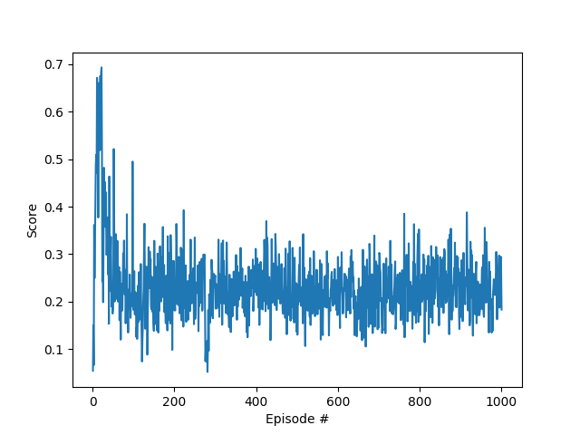
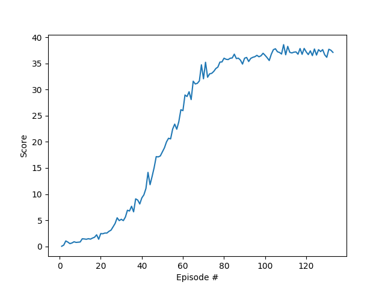

## Iteration 1

The following learning curve shows the agent initialling showing signs of learning. However, it quickly crashes early in training.: 

## Iteration 2

In this iteration we did the following:

* Switch back to a single instance of the agent networks that controls all 20 reacher arms to gain experience
* Reduce the critic LR to `1e-4`
* Reduce the critic OU noise level to sigma `0.1`
* Learn every other time step where 20 experiences are captured at each timestep. This means we gathered 40 experiences and then performed 1 learning update.

The following learning curve shows the agent learns quickly and then maintains a high level of performance. Averaging close to a score of approximately 37 for the last 50 or so episodes: 

