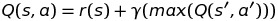
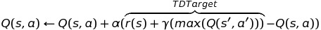
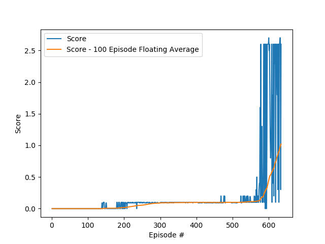

# Learning Algorithm and Model Architecture

In this project, the Tennis environment is solved using two independent DDPG agents controlling each of the actors.
Below, we describe the DDPG algorithm and architecture used to solve the environment. Before describing DDPG,
we first describe the Bellman Equation, TD Learning and DQNs, which are foundational concepts that DDPG builds on. 

**Bellman Equation**

The *Bellman Equation* in the context of Reinforcement Learning is defined below:

The equation is a recursive function which formulates the RL problem a value optimization problem.
Present value is defined as the value of the current state plus the discounted value of future states.
The discounted future reward is calculated assuming optimal actions are taken in all future time steps.
Future rewards are denoted by the *max* term in the Bellman Equation.

**TD Learning**

*Temporal Difference Learning* is a reinforcement learning algorithm based on the Bellman equation that is used to learn value estimation functions.
Below is the TD Update equation:

In order to learn, the algorithm uses an agent to take actions and gather information on rewards based on state-action pairs.
The reward signal provides the agent information on which actions are good actions and which actions are bad actions.

In TD Learning, the *Bellman Equation* is used to define the *TD Target*. 
The *TD Target* estimates the expected state value using the actual reward of the current step and the estimated reward for the next time step.
The *TD Error* is calculated by subtracting the current value estimate from the *TD Target*. The value estimate is then updated by multiplying the *TD Error* by the learning rate, *a*, and adding to the current estimate.

RL methods using TD learning are also, commonly called Q-learning, since the value function in the Bellman equation is often represented as Q.

**Deep Q-Networks**

Together the *Bellman Equation* and the *TD Learning Algorithm* described above form the foundation of value based reinforcement learning methods.
These equations specifically do not prescribe the form that the value function takes. In classical
Reinforcement Learning the value estimate is defined using lookup tables where there is a value estimate enumerated
for each state-action pair. This approach works well for small problems discrete state spaces, but it becomes intractable as state and action spaces grow.

For large or continuous state-action spaces approximate methods can be used. Recent advances in Deep Neural Networks have 
made neural architectures the preferred approach for many common high-dimensional machine learning tasks. Likewise, the neural networks
can be used as the function approximator for reinforcement learning tasks. Q-learning models using a neural network as the Q function
approximator are referred to as Deep Q-Networks (DQN).

**DQN Learning Algorithm**

In the **TD Learning** section above we described how the agent takes actions, observes rewards and learns from those rewards.
We did not discuss how the agent decides which actions to take. If the agent always takes what it believes is the best action
it will never have a chance to discover better actions. If the agent ignores what it knows about good actions and always
takes a random action it is likely to wander about aimlessly. There is a fundamental
trade off between exploring new actions and exploiting the environment by performing actions it knows
are likely to lead to a reward. 

One common approach for balancing the exploitation/exploration trade off is an *epsilon greedy* policy. With this policy,
where the agent takes a random action with probability *epsilon* and takes the best action with probability *1 - epsilon*.

On initalization, the *Q* function weights are randomly initialized which means the *Q* function is a poor estimate of the real
*Q* function. When we don't know much we'd like to favor exploration in order to gain new knowledge and quickly improve our estimate.
As the quality of the estimate improves we'd like to continue searching for a better estimate but somehow leverage our knowledge.
 We can do this by favoring searching near what we believe is the optimal policy. In order accomplish this we define an *epsilon_decay* term.
 On initalization *epsilon* starts high and as training progresses *epsilon* decreases by the decay factor after each episode.
 
In order to smooth out the learning, we'd like gain a variety of experiences before making generalizations about those experiences.
Updating after every experience can cause unnecessary thrashing. We define an update parameter,*update_every*, that will determine how many
episodes of experience we will gain before updating the *Q* estimate.

Another method for smoothing out learning is to define two different *Q* networks, a *target* network and a *local* network.
 The *target* network remains fixed during learning and is used to estimate the future rewards when calculating the *TD Target*.
This makes our *TD Error* estimate less subject to fluctuations during learning. During the learning step, the weights in the local network
are updated based on the gradient from the *TD Error*. After each learning step, the target network is updated by blending the previous *target*
network and the updated *local* network, with *tau* contribution from the *local* network and *1-tau* contribution from the previous *target* network. 
*tau*

**DDPG**

The **DQN** algorithm, is a RL algorithm which learns a *Q* estimator which is then used to make policy decisions. 
This works well for discrete actions spaces where evaluation the *Q* estimate for each action is tractable. The maximal
policy chooses the action with the maximum *Q* estimate.

For continuous action spaces it is intractable to estimate the *Q* value for all possible actions. We need a different 
approach. The *Actor* network defines a function which maps directly from states to actions. The *Actor* function is captured with
a neural network architecture that outputs continuous values avoiding the discrete action limitations of DQNs.

In order, to train the *Actor* we use a *Critic* network which is a *Q* estimator similar to DQNs. During training,
as we gain experience it is added to a replay buffer. During learning the *Critic* is trained similar to the way the *Q*
network is trained in DQN. Then to train the *Actor* network the *Critic* is evaluated to calculate the loss of the *Actor* network.

Now we will describe the chosen network architectures for the *Actor* and *Critic*. Both networks are implemented as a 3 layer
MLP, the two hidden layers are fully connected with ReLU activation. The layers have 256 and 128 units for the first and second layer respectively.
The output layer has tanh activation produce continuous output from -1.0 to 1.0. For both networks, we also
batch normalize the input before feeding into the first layer. In the *Critic*, we feed the state into the first layer and the 
actions are concatenated to the first layer activations which is then fed into the second layer.

*Hyperparameters*

A variety of hyperparameters were evaluated, with the following table describing the chosen hyperparameters along with rationale:

|Parameter|Value|Parameter Description|Rationale|
|----------|-------|------------|---------------|
|BUFFER_SIZE|1e6|replay buffer size|This replay buffer size provides sufficient memory to remember enough history to learn from while minimizing memory resources requirements. Too small of a memory would throw away too much gained experience and slow down learning.| 
|GAMMA|0.99|future reward discount factor|This value balances staying alive to gain future reward and prevents the agent for wondering aimlessly because it doesn't care how far in the future the rewards are obtained. A value less than one gives the agent reason to quickly get to the next reward. If the value is 0, the agent would not care if it dies because future rewards have no value.|
|TAU|2e-1|for soft update of target parameters|The small value of *tau* results in small incremental updates to the target network over time. As time progresses the *target* network will converge to the true *Q* function.|
|LR_ACTOR|1e-4|learning rate|Too small of a learning rate would slow learning down, too large of a learning rate would cause weights to fluctuate and prevent convergence|
|LR_CRITIC|4e-4|learning rate|Too small of a learning rate would slow learning down, too large of a learning rate would cause weights to fluctuate and prevent convergence|
|UPDATE_EVERY|20|how often to update the network|Small values will cause us to make conclusions without much experience. Large values slow learning because we don't stop to reflect on our experiences.|
|NUM_UPDATES|10|how many times to updated the network|Small values will cause us to not learn much from our experience and can cause slow learning, too large of a value would cause our network to be unstable and forget what we've learned|
|eps_start|1.0|starting value of epsilon, for epsilon-greedy action selection|At the beginning of learning we don't know anything so we want to try many different actions to get information about which actions tend to be better|
|eps_decay|0.999|multiplicative factor (per episode) for decreasing epsilon|We'd like to slowly transition from exploring to exploiting. A decay of 0.99 allows us to slowly switch to exploit model. Too high of a decay means we never stop exploring. Too low of a decay value means we stop exploring before we've gained enough experience.|

The following learning curve demonstrates the agent converging after after ~600 episodes. For the Tennis, environment we consider the agents successfully trained when
the highest scoring agent over 100 episodes scores an average score of +0.5: 

# Future Work
 
To further improve the performance of our agent there are variety of approaches that could be evaluated. A short summary
of suggested next steps are described below:

*Hyperparameter Optimization*

The parameters described above we chosen based on intuition and manually evaluating a small number of combinations.
A more thorough parameter search would likely lead to improved model performance. Some common optimization approaches include grid search and bayesian optimization.

*Network Architecture*

We did not extensively evaluate neural network architectures. There are a large variety of neural architectures that are used to solve tasks across many domains. Future work could explore which architectures preform best.

*Learning from Images*

The input state from the Tennis environment included state information, such as position and ray traces from the Unity engine. Future work could explore learning directly from pixels. 
